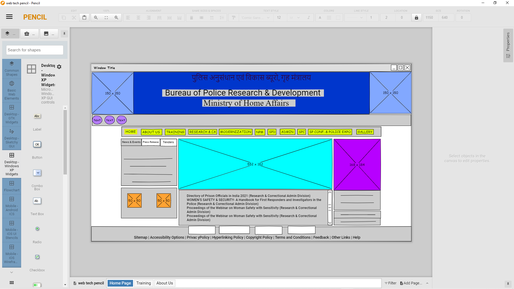
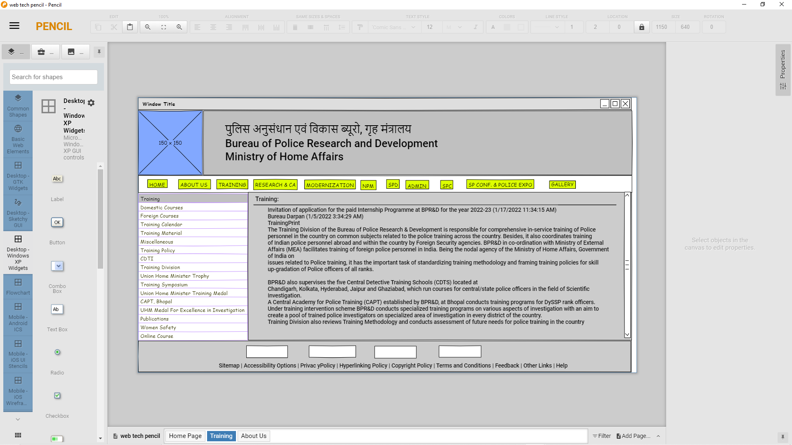
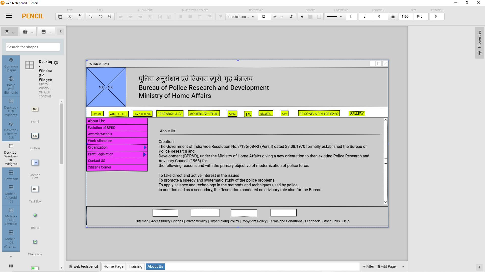

# Wire frame for a website

## AIM:
To design a wire frame for a website.

## DESIGN STEPS:

### Step 1:
Write your design steps here 

### Step 2:
Write your design steps here

## Step 3:
Duplicate tha layout and modify the next pages.

## Step 4:
Save the pages and its done.

## OUTPUT:
## HOME PAGE:

## TRANING PAGE:

## ABOUTUS PAGE:

## Result:
Thus a wire frame is designed for a given website.
